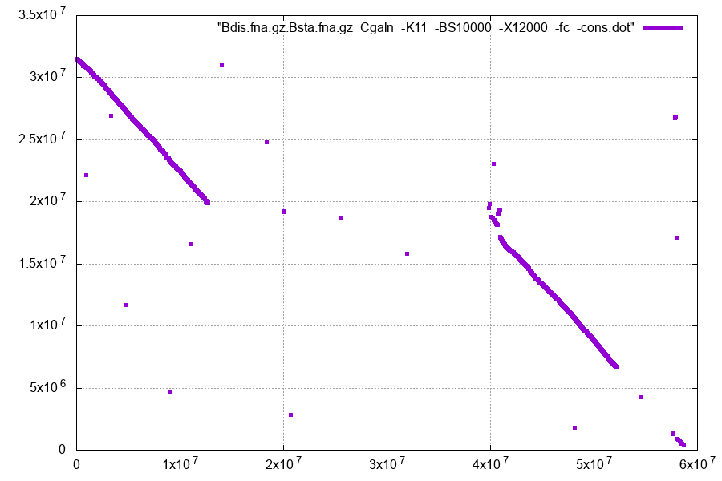
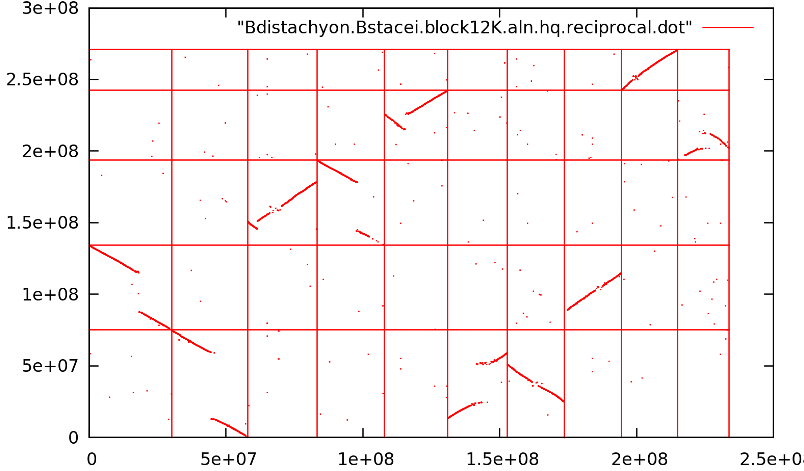

# AlloSHP

This protocol computes Whole Genome Alignments (WGA) to discover Single Homeologous Polymorphisms (SHPs) out of reads mapped to concatenated 
genome sequeces. It requires FASTA and [VCF](https://en.wikipedia.org/wiki/Variant_Call_Format) input files and 
produces multiple sequence alignments of subgenomes that make up allopolyploids.

Rubén Sancho (1,2), Pilar Catalán (2), Bruno Contreras Moreira (1,3)

1. Estación Experimental de Aula Dei-CSIC, Zaragoza, Spain
2. Escuela Politécnica Superior de Huesca, U.Zaragoza, Spain
3. Fundación ARAID, Zaragoza, Spain

## Installation

While this protocol was developed on Linux x86_64 systems, it should also work on MacOS settings.
It requires some standard Linux utilities (gzip, sort, perl, make, python3, g++, etc) and a few third-party dependencies
which can be installed locally as follows:

    git clone https://github.com/eead-csic-compbio/AlloSHP.git
    cd AlloSHP
    make install
    # optionally, takes a couple minutes
    make test

#### Troubleshooting: conda environment

Should the standard installation instructions fail, you might want to try the following conda approach:

    conda create --name AlloSHP
    conda activate AlloSHP
    conda install -c conda-forge cxx-compiler perl-db_file git gnuplot     
    git clone https://github.com/eead-csic-compbio/AlloSHP.git
    cd AlloSHP
    make install # currently only Cgaln supported

### Dependencies 

The table shows the main dependencies of this package:

|software|flag|source|notes|
|:-------|:---|:-----|:----|
|Cgaln|  |https://github.com/rnakato/Cgaln|requires gcc compiler|
|GSAlign| -g |https://github.com/hsinnan75/GSAlign|requires g++ compiler|
|Red|skipped with -m|https://github.com/EnsemblGenomes/Red|requires g++ compiler|
|Red2Ensembl.py|   |https://github.com/Ensembl/plant-scripts|requires python3|
|gnuplot|  |http://www.gnuplot.info|required for dotplots in PDF format| 

Other Linux dependencies required include: `wget python3 g++ gnuplot-qt libdb-dev` 

See [ci.yml](https://github.com/eead-csic-compbio/vcf2alignment/blob/master/.github/workflows/ci.yml).

## Pipeline overview

<!-- flowchart -->

## 1) Input data 

These are the data files required to run this pipeline:

+ 2+ FASTA files of genome assemblies of diploid species of the taxa of interest, one file per species.
Our *Brachypodium* [sample data](https://github.com/eead-csic-compbio/vcf2alignment/tree/master/sample_data)
includes the GZIP compressed genomes of *Brachypodium distachyon* and *Brachypodium stacei*, 
which are named `Bdis.fna.gz` and `Bsta.fna.gz`. **Each file should have unique chromosome names**.

+ A VCF file with GBS/RADseq/RNAseq/WGS sequence reads of presumably polyploids mapped to the concatenated previously described FASTA files.
See file `BdisBd2_BstaChr01.vcf.gz` in [sample data](https://github.com/eead-csic-compbio/vcf2alignment/tree/master/sample_data)
for an example.

## 2) How to run

A typical analysis involves calling three scripts: [WGA](https://github.com/eead-csic-compbio/AlloSHP/blob/master/WGA), 
[vcf2alignment](https://github.com/eead-csic-compbio/AlloSHP/blob/master/WGA) and 
[vcf2synteny](https://github.com/eead-csic-compbio/AlloSHP/blob/master/WGA). 

Note that the steps below can be run in one go as follows:

    make test

### 2.1) Whole-genome alignments (WGA)

WGAs must be computed to find syntenic segments among the reference genomes available for read mapping.
By default this uses [CGaln](https://github.com/rnakato/Cgaln),
which requires the input sequences to be [soft-masked](https://genomevolution.org/wiki/index.php/Masked) ahead.
In our example we set *B. distachyon* as the master reference genome for being the best quality assembly at hand
(see 2.3 below).
In this we now find out syntenic segments on the other genomes, defined as secondary genomes (*B. stacei*). 
Each individual reference is hence considered a **subgenome** to which reads map:

    ./WGA -A sample_data/Bdis.fna.gz -B sample_data/Bsta.fna.gz

This produces the following output:

    ## ./WGA -A sample_data/Bdis.fna.gz -B sample_data/Bsta.fna.gz -o Bdis.fna.gz.Bsta.fna.gz -l 1 -m 1 -G 0 -I -K11 -BS10000 -C -X4000 -M 0.25 0.05 -n 4

    ## root: Bdis.fna.gz.Bsta.fna.gz_Cgaln_-K11_-BS10000_-X4000_0.25_0.05

    # filter_FASTA_sequences: [passed 59130575 bp] Bd2
    # filter_FASTA_sequences: [passed 31564145 bp] Chr01

    # chrcode A example: Bd(\d+)
    # chrcode B example: Chr(\d+)

    ## soft-masking filtered sequences

    # filtered file A: sample_data/Bdis.fna.gz.sm.fasta
    # filtered file B: sample_data/Bsta.fna.gz.sm.fasta

    ## CGaln algorithm

    ## indexing masked, filtered sequences

    [...]

    ## computing and plotting Whole Genome Alignment

    [...]

    ## converting Whole Genome Alignment to BED

    ## output files:

    # BED: Bdis.fna.gz.Bsta.fna.gz/Bdis.fna.gz.Bsta.fna.gz_Cgaln_-K11_-BS10000_-X4000_0.25_0.05.bed
    # LOG: Bdis.fna.gz.Bsta.fna.gz/Bdis.fna.gz.Bsta.fna.gz_Cgaln_-K11_-BS10000_-X4000_0.25_0.05.coords.log
    # PDF: Bdis.fna.gz.Bsta.fna.gz/Bdis.fna.gz.Bsta.fna.gz_Cgaln_-K11_-BS10000_-X4000_0.25_0.05.dot.pdf

    ## WGA summary: valid blocks: 54 unique positions: 8956568

    # time used (s): 119 memory used (Mb): 407.9

The most important result files are the 0-based **BED** list of syntenic positions, which will be used in the last step,
and the **PDF** dotplot, which requires `gnuplot` in your syste, which must be inspected to assess the quality of
the WGA. Note that flags `-I` and `-C` can be used to tweak the WGA parameters after inspection of the dotplot.
Also, you can use `-o` to set your own **output folder**.

Alternatively, the GSAlign WGA algorithm can be invoked as follows, with flag `-g`:
 
    ./WGA -A sample_data/Bdis.fna.gz -B sample_data/Bsta.fna.gz -g

Note that you can change the default GSAlign settings with optional flag `-G`. This might be required for your genomes of interest.

*Figure 1. WGA dotplot resulting from Cgaln alignment of two homologous chromosomes.*

*Figure 2. Multi-chromosome WGA dotplot.* A good WGA dotplot will have long diagonal runs of aligned genome regions instead of clouds.

### 2.2) Filtering valid positions in the VCF file

Script `vcf2alignment` parses an input VCF file, with might be GZIP/BZIP2 compressed, 
and produces a list of valid sites considering min read depth (-d) and max missing data (-m).
Note this requires a config file that matches sample names in the VCF file to their human-readable names
(see example [sample_data/config.tsv](https://github.com/eead-csic-compbio/vcf2alignment/blob/master/sample_data/config.tsv)).
A report log file with valid 1-based coordinates (-l) is saved to be used in the last step:

    ./vcf2alignment -v sample_data/BdisBd2_BstaChr01.vcf.gz -c sample_data/config.tsv -l BdisBd2_BstaChr01.vcf.log.gz -d 5 -m 3

### 2.3) Producing a multiple sequence alignment of polyploid subgenomes

Script `vcf2synteny` puts it all together and produces an alignment in FASTA format:
 
    ./vcf2synteny -v sample_data/BdisBd2_BstaChr01.vcf.gz -c sample_data/config.synteny.tsv -l BdisBd2_BstaChr01.vcf.log.gz \
			-d 5 -m 3 -r Bdis -o BdisBd2_BstaChr01.DP5.M3.synteny.fasta

Note that a different config file is now used (see example 
[sample_data/config.synteny.tsv](https://github.com/eead-csic-compbio/vcf2alignment/blob/master/sample_data/config.synteny.tsv)),
which also contains: 

+ a path to the BED file obtained in step 2.1
+ regular expressions to match chromosome names from reference genomes used in step 2.1, can use those proposed by `WGA`

Note that `vcf2synteny` performs several sort operations. With large genomes these might require significant disk space to save temporary results.
By default these are stored in `/tmp` but this can be changed with flag `-t`. The examples in the [Makefile](./Makefile) use `-t` 
pointing to the same **output folder** used by `WGA`, so that all files are contained there and can be safely removed if needed.
 
Anyway, this scripts produces the following output:

    # computing Bdis.Bsta.coords.positions.tsv (3 steps)

    # master reference: Bdis
    # secondary references: Bsta
    # synteny files (SYNTENYZEROBASED=1): 
    # Bsta : _Bdis.Bsta.coords.positions.tsv...
    # total positions=762307

    # decompressing VCF file with GZIP
    # number of samples found=6
    # number of loci read from VCF: 10000
    ...
    # number of loci read from VCF: 760000
    # sorting SNPs by position ...
    # aligned position: Bd2_48166443 : Chr01_1718238,
    ...
    # aligned position: Bd2_58679964 : Chr01_384888,  
    # number of valid loci=762307
    # number of polymorphic loci=9512

    # Bdis_ABR2_Bdis variants: 0 / 762307
    # Bdis_ABR2_Bsta variants: 8471 / 762307
    # Bdis_Bd21Control_Bdis variants: 0 / 762307
    # Bdis_Bd21Control_Bsta variants: 4048 / 762307
    # Bhyb_Bhyb26_Bdis variants: 0 / 762307
    # Bhyb_Bhyb26_Bsta variants: 741493 / 762307
    # Bhyb_ABR113_Bdis variants: 0 / 762307
    # Bhyb_ABR113_Bsta variants: 677818 / 762307
    # Bsta_ABR114_Bdis variants: 0 / 762307
    # Bsta_ABR114_Bsta variants: 728488 / 762307
    # Bsta_TE4.3_Bdis variants: 0 / 762307
    # Bsta_TE4.3_Bsta variants: 754853 / 762307

The resulting multiple sequence alignment (MSA) has as many lines per sample as references, which are handled as subgenomes.
The first 200 positions of the MSA derived from the sample data look as follows:

    >Bdis_ABR2_Bdis
    NNNNNNNNNNNNNNNNNNNNNNNNNNNNNNNNNNNNNNNNNNNNNNNNNNNNNNNNNNNNNNNNNNNNNNNNNNNNNNNNNNNNNNNNNNNNNNNNNNNNNNNNNNNNNNNNNNNNNNNTCNNNNANNCNNNNNNNNNNNNNNNCNTNNNNTNNNNNNNNNNNNNGNTNNNNNTNNGGCNNNNNNNNNNNNNNGANANCC
    >Bdis_ABR2_Bsta
    ATCTCGCGGCTGCCCCCCCGAGTTCGGAGGACCACCGGCCTCGCCGGGCCTCCACGTCGTGGCCACTGCTTCGGCAACGCACTGCTGACCTCACCGCTGCCGTCGCACTGGCAAACGGGTCAGCAAATCAAGCGCGCTGCGTGTCGTCNCGTCTCGGGCCATGCCGCTTTTCATCTGGCCGCCCTGGTTGCGCGACACCC
    >Bdis_Bd21Control_Bdis
    NNNNNNNNNNNNNNNNNNNNNNNNNNNNNNNNNNNNNNNNNNNNNNNNNNNNNNNNNNNNNNNNNNNNNNNNNNNNNNNNNNNNNNNNNNNNNNNNNNNNNNNNNNNNNNNNNNNNNNNTCNNNNANNCNNNNNNNNNNNNNNNCNTNNNNTNNNNNNNNNNNNNGNTNNNNNTNNGGCNNNNNNNNNNNNNNGANANCC
    >Bdis_Bd21Control_Bsta
    NNNNNNNNNNNNNNNNNNNNNNNNNNNNNNNNNNNNNNNNNNNNNNNNNNNNNNNNNNNNNNNNNNNNNNNNNNNNNNNNNNNNNNNNNNNNNNNNNNNNNNNNNNNNNNNNNNNNNNNNNNNNNNNNNNNNNNNNNNNNNNNNNNNNNNNNNNNNNNNNNNNNNNNNNNNNNNNNNNNNNNNNNNNNNNNNNNNNNNNN
    >Bhyb_Bhyb26_Bdis
    NNNNNNNNNNNNNNNNNNNNNNNNNNNNNNNNNNNNNNNNNNNNNNNNNNNNNNNNNNNNNNNNNNNNNNNNNNNNNNNNNNNNNNNNNNNNNNNNNNNNNNNNNNNNNNNNNNNNNNNTCNNNNANNCNNNNNNNNNNNNNNNCNTNNNNTNNNNNNNNNNNNNGNTNNNNNTNNGGCNNNNNNNNNNNNNNGANANCC
    >Bhyb_Bhyb26_Bsta
    ATCTCGCGGCTGCCCCCCCGAGTTCGGAGGACCACCGGCCTCGCCGGGCCTCCACGTCGTGGCCACTGCTTCGGCAACGCACTGCTGACCTCACCGCTGCCGTCGCACTGGCAAACGGGTCAGCAAATCAAGCGCGCTGCGTGTCNTCGCGTCTCGGGCCATGCCGCTTTTCATCTGGCCGCCCTGGTTGCGCGACACCC
    >Bhyb_ABR113_Bdis
    NNNNNNNNNNNNNNNNNNNNNNNNNNNNNNNNNNNNNNNNNNNNNNNNNNNNNNNNNNNNNNNNNNNNNNNNNNNNNNNNNNNNNNNNNNNNNNNNNNNNNNNNNNNNNNNNNNNNNNNNNNNNNNNNNNNNNNNNNNNNNNNNNNNNNNNNNNNNNNNNNNNNNNNNNNNNNNNNNNNNNNNNNNNNNNNNNNNNNNNN
    >Bhyb_ABR113_Bsta
    NNNNNNNNNNNNNNNNNNNNNNNNNNNNNNNNNNNNNNNNNNNNNNNNNNNNNNNNNNNNNNNNNNNNNNNNNNNNNNNNNNNNNNNNNNNNNNNNNNNNNNNNNNNNNNNNNNNNNNNNNNNNNNNNNNNNNNNNNNNNNNNNNNNNNNNNNNNNNNNNNNNNNNNNNNNNNNNNNNNNNNNNNNNNNNNNNNNNNNNN
    >Bsta_ABR114_Bdis
    NNNNNNNNNNNNNNNNNNNNNNNNNNNNNNNNNNNNNNNNNNNNNNNNNNNNNNNNNNNNNNNNNNNNNNNNNNNNNNNNNNNNNNNNNNNNNNNNNNNNNNNNNNNNNNNNNNNNNNNNNNNNNNNNNNNNNNNNNNNNNNNNNNNNNNNNNNNNNNNNNNNNNGNTNNNNNTNNGGCNNNNNNNNNNNNNNGANANCC
    >Bsta_ABR114_Bsta
    ATCTCGCGGCTGCCCCCCCGAGTTCGGAGGACCACCGGCCTCGCCGGGCCTCCACGTCGTGGCCACTGCTTCGGCAACGCACTGCTGACCTCACCGCTGCCGTCGCACTGGCAAACGGGTCAGCAAATCAAGCGCGCTGCGTGTCGTCGCGTCTCGGGCCATGCCGCTTTTCATCTGGCCGCCCTGGTTGCGCGACACCC
    >Bsta_TE4.3_Bdis
    NNNNNNNNNNNNNNNNNNNNNNNNNNNNNNNNNNNNNNNNNNNNNNNNNNNNNNNNNNNNNNNNNNNNNNNNNNNNNNNNNNNNNNNNNNNNNNNNNNNNNNNNNNNNNNNNNNNNNNNNNNNNNNNNNNNNNNNNNNNNNNNNNNNNNNNNNNNNNNNNNNNNNNNNNNNNNNNNNNNNNNNNNNNNNNNNNNNNNNNN
    >Bsta_TE4.3_Bsta
    NNNNNNNNNNNNNNNNNNNNNNNNNNNNNNNNNNNNNNNNNNNNNNNNNNNNNNNNNNNNNNNNNNNNNNNNNNNNNNNNNNNNNNNNNNNNNNNNNNNNNNNNNNNNNNNNNNNNNNNNNNNNNAATCAAGCGCGCTGCGTGTCGTCGCGTCTCGGGCCATGCCGCTTTTCATCTGGCCGCCCTGGTTGCGCGACACCC

This completes this protocol.

### 2.4) Other uses: get a multiple sequence alignment of samples in a VCF file

Working with collaborators we have noticed that often you need to produce a multi FASTA file out of the samples in a VCF file.
A typical reason for this is to compute a phylogenetic tree. Please note that `vcf2alignment` can be used exactly for this as follows,
note the optional -o flag. If the input VCF file does not contain DP data, or you want to take all base calls regardless of their depth,
add also -d: 

    ./vcf2alignment -v sample_data/BdisBd2_BstaChr01.vcf.gz -c sample_data/config.tsv -l kk.log.gz -d 0 -o BdisBd2_BstaChr01.fasta

## 3) Citation

this paper, to be written

Lin HN, Hsu WL (2020) GSAlign: an efficient sequence alignment tool for intra-species genomes. BMC Genomics 21:182. https://doi.org/10.1186/s12864-020-6569-1

Nakato R, Gotoh O (2010) Cgaln: fast and space-efficient whole-genome alignment. BMC Bioinformatics 11:224. https://doi.org/10.1186/1471-2105-11-224

Girgis HZ (2015) Red: an intelligent, rapid, accurate tool for detecting repeats de-novo on the genomic scale. BMC Bioinformatics 16:227. https://doi.org/10.1186/s12859-015-0654-5

Contreras-Moreira B, Filippi CV, Naamati G, García Girón C, Allen JE, Flicek P (2021) Efficient masking of plant genomes by combining kmer counting and curated repeats Genomics. Plant Genome https://doi.org/10.1002/tpg2.20143

