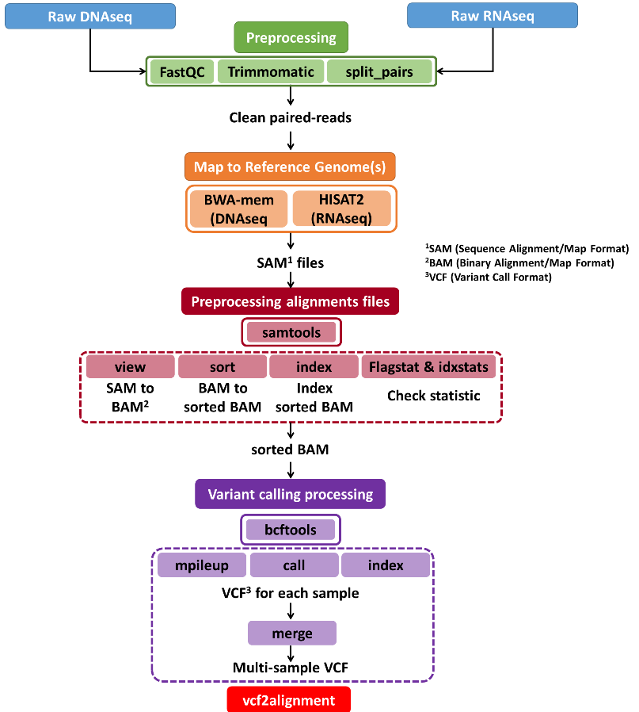
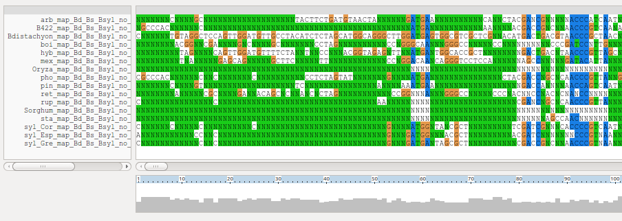

# vcf2alignment

Protocol to produce multiple sequence alignments out of [VCF](https://en.wikipedia.org/wiki/Variant_Call_Format)
files which can be used for phylogenetic tree construction. 

**Authors**
Rubén Sancho (1,2), Bruno Contreras Moreira (1,3)

1. Estación Experimental de Aula Dei-CSIC, Zaragoza, Spain
2. Escuela Politécnica Superior de Huesca, U.Zaragoza, Spain
3. Fundación ARAID, Zaragoza, Spain

## Pipeline overview

<!-- flowchart -->

### Software dependencies

This protocol has been tested on Linux x86_64 systems, although it should also work on Mac-OSX settings.
It requires Perl5, which should be installed on all Linux environments, plus some standard programs (gzip, bzip2).


## 1) Input data 

These are the data required to run this pipeline:

+ 1+ (ideally more) reference genomes of species of the taxa of interest, **concatenated in a single FASTA file**.
In our *Brachypodium* benchmark we selected three reference genomes 
(*Bdistachyon.fna*, *Bstacei.fna* and *Bsylvaticum.fna*) and 
only used complete chromosome arms, and left out single contigs and centromeric parts. 
This might require renaming chromosomes to make sure that each species has unique names.

+ **FASTQ files** from the samples to be analyzed, which should belong to the same taxa, and perhaps some outgroups as well.
These can be GBS, RADseq, RNAseq or even WGS sequence reads.

*In the forthcoming sections we illustrate how to test this pipeline with three reference genomes
used in our benchmark (Bdistachyon.fna, Bstacei.fna and Bsylvaticum.fna),
which have the following chromosome name prefixes, respectively: Bd, Chr and chr.*

## 2) Simple mode: mapped reads

### 2.1) Read mapping 

<!-- Explicar los mapeos con BWA mem o Hisat2, segun sea

Explicar que habra muestras con depth of coverage mas limitada y otras mejores,
aparte de otras que se pueden definir como outgroups para los arboles poesteriores
 -->

### 2.2) Merging mappings to produce a single non-redundant VCF file

This process is summarized in the next flowchart:


<!-- Explicar los comandos para ir desde los multiples SAM a un solo VCF --> 

```{shell ,eval=FALSE}
utils/rm_double_lines.pl RNAseq_Bd5_Chr10_chr10.raw.vcf > sample_data/RNAseq_Bd5_Chr10_chr10.vcf
bzip2 sample_data/RNAseq_Bd5_Chr10_chr10.vcf
```

### 2.3) Producing a multiple alignment file

Script [vcf2alignment.pl](./vcf2alignment.pl) ships with the following global variables which might be modified 
in the source code (with a text editor) to change the expected outcome:

| variable name | default value | definition |
|:-----|:---------------:|:-------|
| $MINDEPTHCOVERPERSAMPLE | 10 | natural, min number of reads mapped supporting a locus |
| $MAXMISSINGSAMPLES | 8 | natural, max number of missing samples accepted per locus |
| $ONLYPOLYMORPHIC | 1 | set to 0 to keep fixed loci, helps with sparse data |
| $OUTFILEFORMAT | fasta | currently can also take nexus and phylip format |

By default, the produced alignment is in FASTA format. Note that a logfile is also saved in this example,
which contains a list of valid loci and several statistics. 
In our tests, we found that $ONLYPOLYMORPHIC=0 worked well with RNAseq data:
```{shell}
./vcf2alignment.pl sample_data/RNAseq_Bd5_Chr10_chr10.vcf.bz2 \
  sample_data/RNAseq_Bd5_Chr10_chr10.fna &> sample_data/RNAseq_Bd5_Chr10_chr10.log 
```

If the format is changed in the source to 'phylip', 
an [interleaved PHYLIP](http://evolution.genetics.washington.edu/phylip/doc/sequence.html) 
file is produced, with names shortened to 10 chars (see source code to choose from prefixes or suffixes):
```{shell}
./vcf2alignment.pl sample_data/RNAseq_Bd5_Chr10_chr10.vcf.bz2 \
  sample_data/RNAseq_Bd5_Chr10_chr10.phy &> sample_data/RNAseq_Bd5_Chr10_chr10.log
```

As mentioned, [NEXUS](https://en.wikipedia.org/wiki/Nexus_file) alignments can also be produced 
by editing the source to 'nexus':
```{shell}
./vcf2alignment.pl sample_data/RNAseq_Bd5_Chr10_chr10.vcf.bz2 \
  sample_data/RNAseq_Bd5_Chr10_chr10.nex &> sample_data/RNAseq_Bd5_Chr10_chr10.log
```

The produced multiple alignment should be rendered with appropriate software for visual quality check:



## 3) Advanced mode: syntenic coordinates + mapped reads

This mode requires the simple mode to be run before-hand, as it expects a pre-computed logfile.

### 3.1) Whole-genome alignments

Alignments must be computed to find syntenic segments among the reference genomes available for read mapping.
We selected [CGaln](http://www.iam.u-tokyo.ac.jp/chromosomeinformatics/rnakato/cgaln/index.html) for this task,
which requires the input sequences to be [soft-masked](https://genomevolution.org/wiki/index.php/Masked) ahead.
These files are not included here as they're bulky, but we do show how we use processed them in our benchmark:

```{shell, eval=FALSE}
# index individual references (n=3)
~/soft/Cgaln/maketable Bdistachyon_msk.fna
~/soft/Cgaln/maketable Bstacei_msk.fna
~/soft/Cgaln/maketable Bsylvaticum_msk.fna

# alignments with custom parameters

~/soft/Cgaln/Cgaln Bdistachyon_msk.fna Bstacei_msk.fna \
  -o Bdistachyon.Bstacei.block12K.aln.hq.fna -r -X12000 -fc -cons -otype2

~/soft/Cgaln/Cgaln Bdistachyon_msk.fna Bsylvaticum_msk.fna \
  -o Bdistachyon.Bsylvaticum.block12K.aln.hq.fna -r -X12000 -fc -cons -otype2 
```

We recomend that users visualize the alignments to make sure they make sense and to optimize CGaln parameters. 
This can be done producing *.dot* files instead of FASTA output:
```{shell, eval=FALSE}
~/soft/Cgaln/Cgaln Bdistachyon_msk.fna Bstacei_msk.fna \
  -o Bdistachyon.Bstacei.block12K.aln.hq.dot -r -X12000 -fc -cons 

~/soft/Cgaln/Cgaln Bdistachyon_msk.fna Bsylvaticum_msk.fna \
  -o Bdistachyon.Bsylvaticum.block12K.aln.hq.dot -r -X12000 -fc -cons 
```
These files can then be inspected with gnuplot:

```{shell, eval=FALSE}
gnuplot
gnuplot> plot "result.dot" with lines
```
This an example whole-genome alignment plot:


These alignments can then be compressed and equivalent/syntenic positions extracted 
with script [mapcoords.pl](./utils/mapcoords.pl) as follows: 
```{shell, eval=FALSE}
utils/mapcoords.pl Bdistachyon.Bstacei.block12K.aln.hq.fna.gz Bdistachyon_msk.fna Bstacei_msk.fna \
  > Bdistachyon.Bstacei.coords.tsv 2> Bdistachyon.Bstacei.coords.log
gzip Bdistachyon.Bstacei.coords.tsv

utils/mapcoords.pl Bdistachyon.Bsylvaticum.block12K.aln.hq.fna.gz Bdistachyon_msk.fna Bsylvaticum_msk.fna \
  > Bdistachyon.Bsylvaticum.coords.tsv 2> Bdistachyon.Bsylvaticum.coords.log
gzip Bdistachyon.Bsylvaticum.coords.tsv
```

A few more operations in the terminal are required to produce the final files, which are provided in [sample_data](./sample_data/):
```{shell, eval=FALSE}
grep "valid locus" RNAseq_Bd5_Chr10_chr10.log | grep -v -P "Bd\d+" | grep chr | \
perl -lne 'if(/(chr\d+)_(\d+)/){ printf("%s.%d\n",$1,$2-1) }' | sort | uniq > list_Bsylvaticum_SNPs.coords

grep "valid locus" RNAseq_Bd5_Chr10_chr10.log | grep -v -P "Bd\d+" | grep Chr | \
perl -lne 'if(/(Chr\d+)_(\d+)/){ printf("%s.%d\n",$1,$2-1) }' | sort | uniq > list_Bstacei_SNPs.coords

grep "valid locus" RNAseq_Bd5_Chr10_chr10.log | \
perl -lne 'if(/(Bd\d+)_(\d+)/){ printf("%s\t%d\n",$1,$2-1) }' | sort -k1,1 -k2,2n | uniq > list_Bdistachyon_SNPs.coords

join -o "1.1 1.2 1.3 1.4 1.5 1.6 1.7 1.8" -1 5 -2 1 <(zcat Bdistachyon.Bstacei.coords.tsv.gz | \
perl -lane 'print join(" ",@F[0 .. 3])." $F[4].".join(" ",@F[5 .. 8])' |sort -k5,5 -S 80G) list_Bstacei_SNPs.coords | \
perl -plne 's/[\s\.]/\t/g' > sample_data/Bdistachyon.Bstacei.coords.SNP.tsv

join -o "1.1 1.2 1.3 1.4 1.5 1.6 1.7 1.8" -1 5 -2 1 <(zcat Bdistachyon.Bsylvaticum.coords.tsv.gz | \
perl -lane 'print join(" ",@F[0 .. 3])." $F[4].".join(" ",@F[5 .. 8])' |sort -k5,5 -S 80G) list_Bsylvaticum_SNPs.coords | \
perl -plne 's/[\s\.]/\t/g' > sample_data/Bdistachyon.Bsylvaticum.coords.SNP.tsv
```

### 3.2) Producing a multiple alignment file

Now we call script [vcf2alignment_synteny.pl](./vcf2alignment_synteny.pl) to output an alignment in FASTA format. 
Note that now the alignment splits each sample in as many subgenomes as references were concatenated.
As mentioned earlier, in our tests we found that $ONLYPOLYMORPHIC=0 worked well with RNAseq data:
```{shell}
./vcf2alignment_synteny.pl sample_data/RNAseq_Bd5_Chr10_chr10.vcf.bz2 \
  sample_data/RNAseq_Bd5_Chr10_chr10_synteny.fna &> sample_data/RNAseq_Bd5_Chr10_chr10_synteny.log
```

